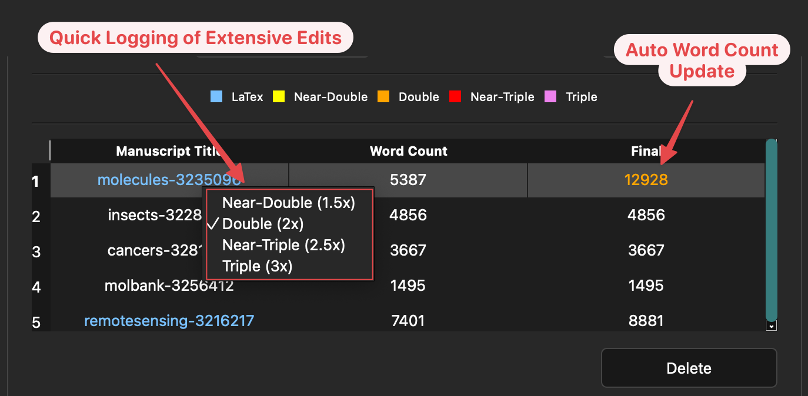
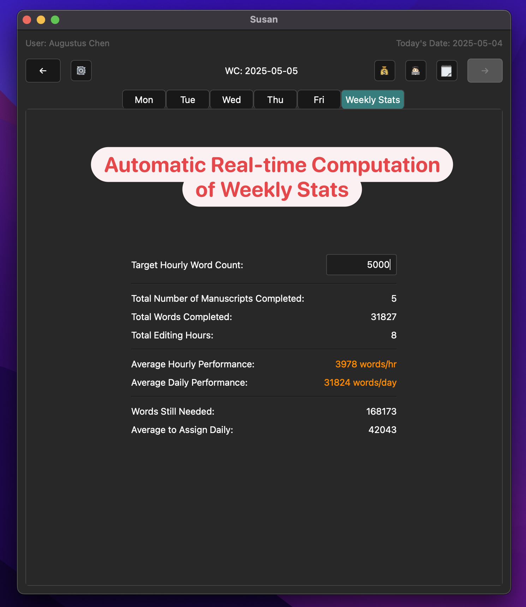
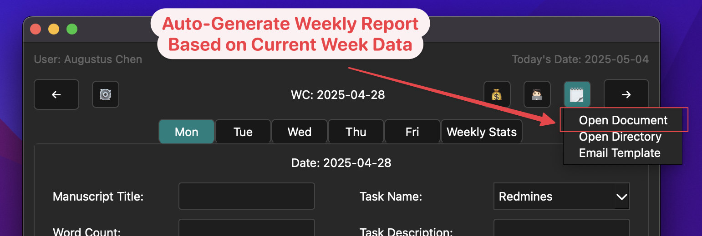
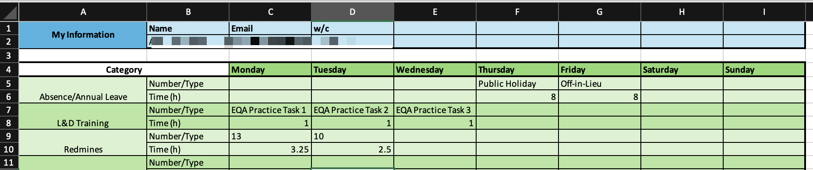
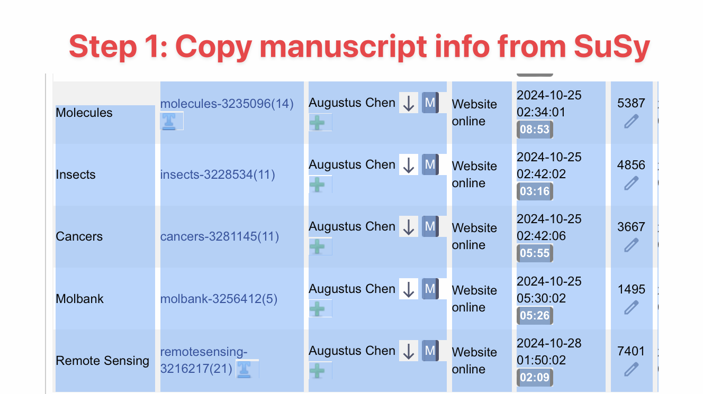
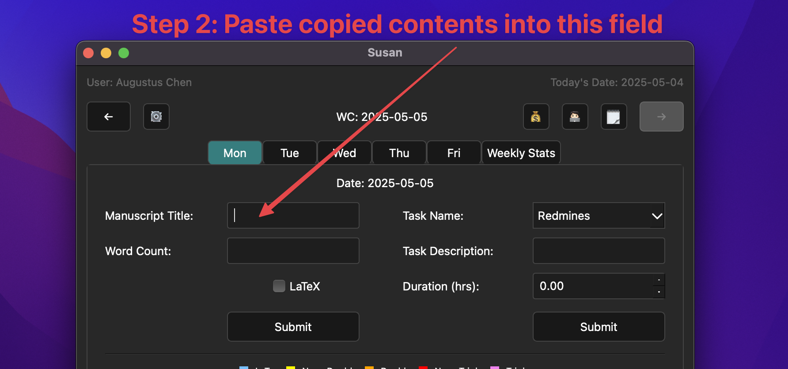
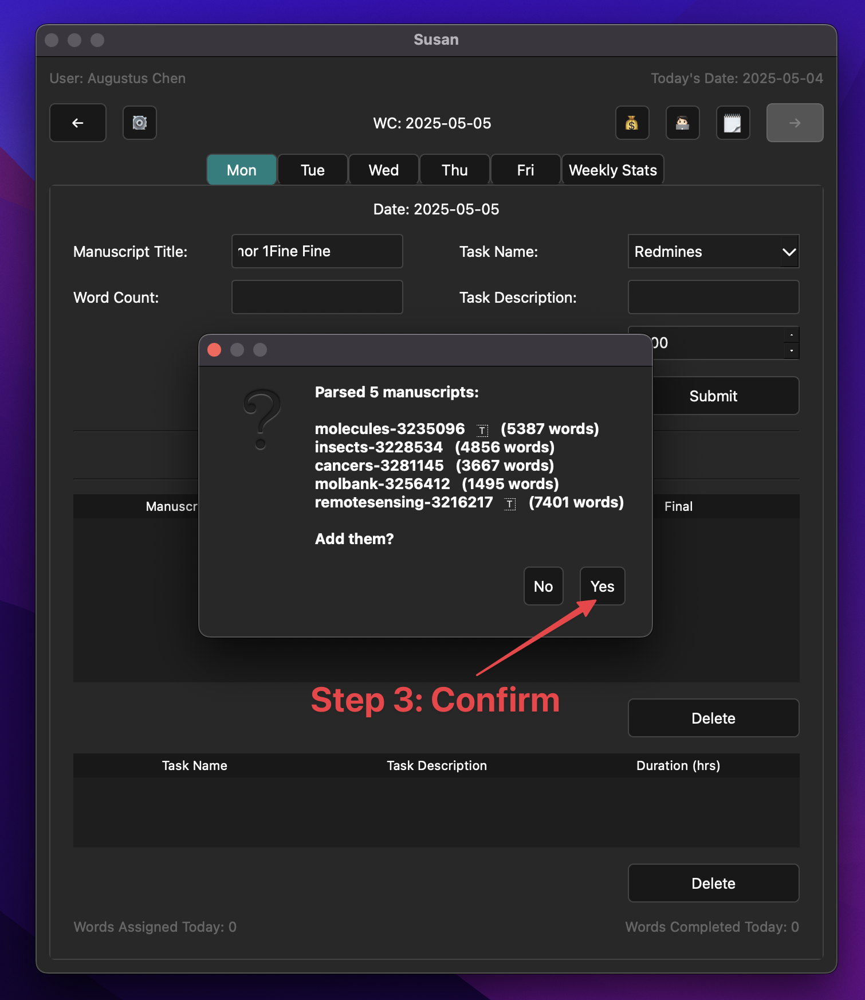
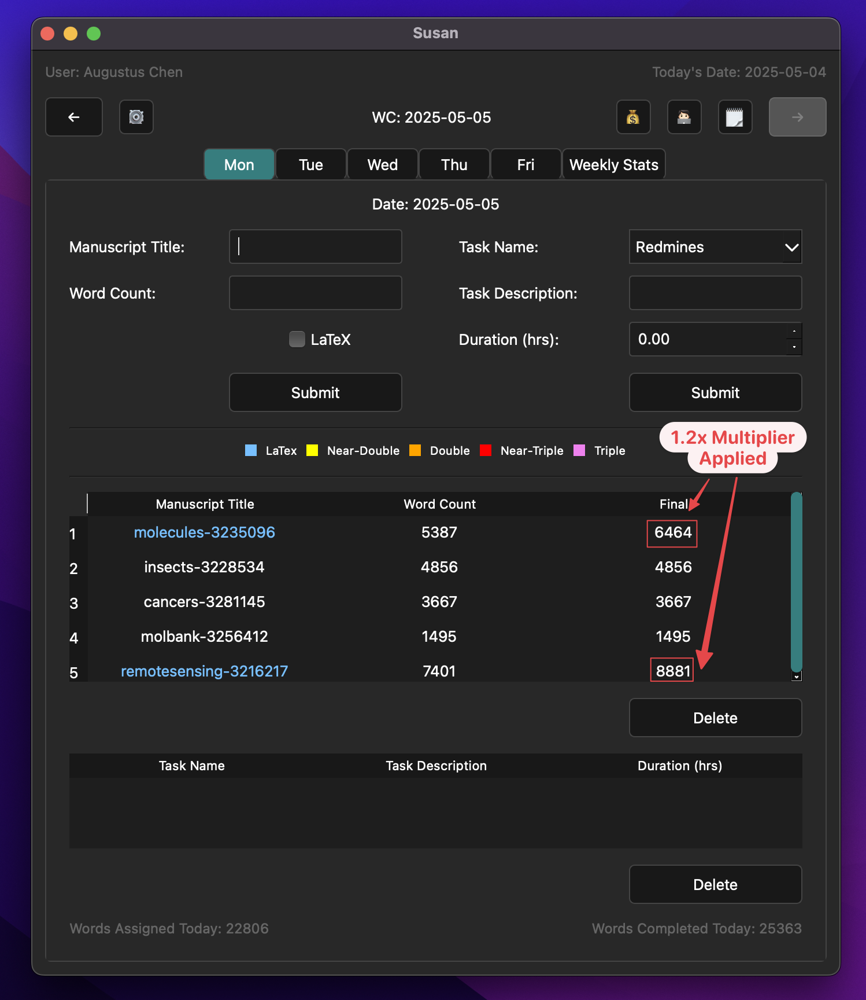
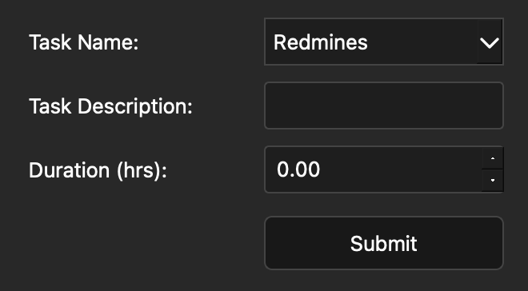
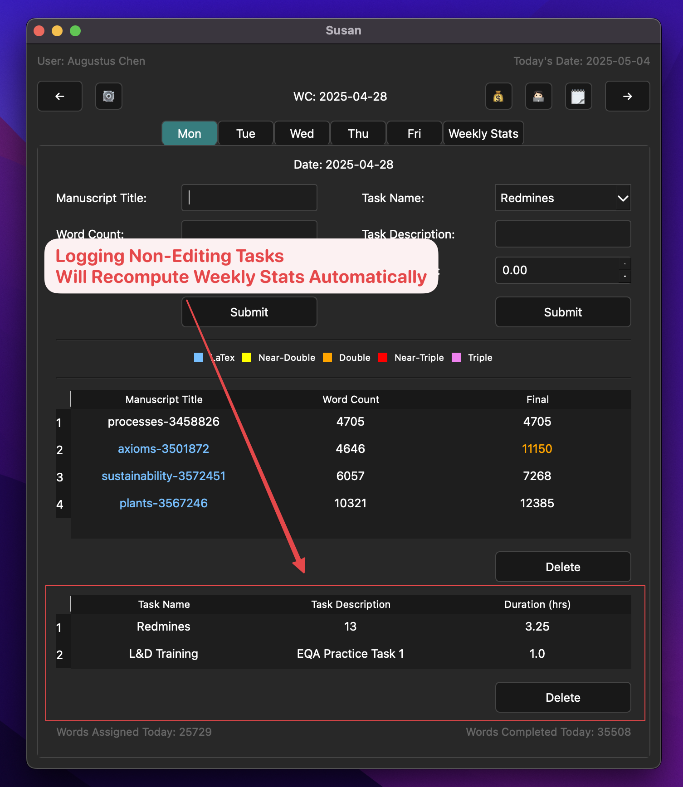

# Susan (Demo)

  

A real-time efficiency tracking tool optimized for the EE workflow.

---

# Table of Contents
1. [Key Features](#key-features)  
2. [Quick Start](#quick-start)

---

# Key Features

## Automatic Batch Logging
No need for manual one-by-one pasting—just copy the entire block and everything is parsed automatically, including LaTeX status.

See [Logging Editing Tasks](#logging-editing-tasks) for a demo.

## Quick Logging of Extensive Edits
Mark an edit as near-double, double, near-triple, or triple simply through a right-click menu. The finalized word count auto-updates in real time.

  

## Real-time Computation of Weekly Statistics
In the "Weekly Stats" tab, several relevant metrics related to editing efficiency will be computed in real time based on the information from the logged editing and non-editing tasks.

  

## Automatic Weekly Report Generation
Automatically generate a weekly report in the required format, based on the information from the logged editing and non-editing tasks. This eliminates the human-error aspect of manually cross-referencing information.

  
    
  

## Automatic Date Tracking
The program knows what week (and what WC) you are on, and jumps to the appropriate location on launch. 

---

# Quick Start

## Logging Editing Tasks

1. Copy a block of assigned manuscripts from SuSy.  

  

2. Paste into the program's input field.  

  
  

 

3. Everything is logged automatically!  

  

## Logging Non-Editing Tasks

1. Select task name.  
2. Enter task description.  
3. Select task duration.

  
  

